  

---

### 🌌 About Me

I am a passionate software developer blending code and aesthetics to build interactive web applications and sleek user interfaces.

- 🔭 **Currently working on**: Immersive web applications with React and high-performance Go backends.
- 📚 **Learning & exploring**: System architecture, cloud scaling, and advanced SVG micro-animations.
- ⚡ **Fun fact**: I believe terminals and tools should always default to dark mode.

---

### 🛠️ Tech Stack & Toolkit

**Frontend:**  

**Backend & Databases:**  

**DevOps & Tools:**  

---

### 📊 GitHub Stats

  

---

### 🚀 Featured Projects

- 🛰️ **NeonSynth Web Shell**: A web-based SSH terminal emulator with highly-customized theme selectors.
  - *Stack*: React, TypeScript, Node.js, Socket.io
- 🧬 **BioFlow Pipeline Engine**: A Go-based workflow pipeline engine designed to schedule and process assets concurrently.
  - *Stack*: Go, Redis, Docker, gRPC

---

  Designed with 💜 by <a href="https://github.com/anonymouschichvy">anonymouschichvy</a>

